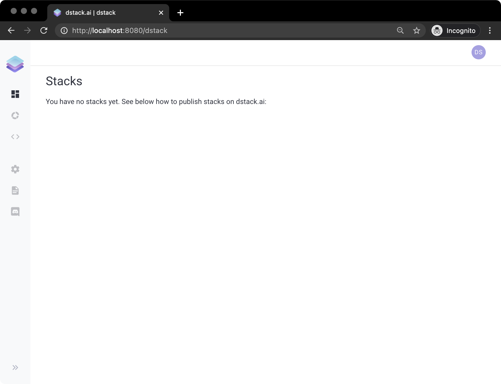
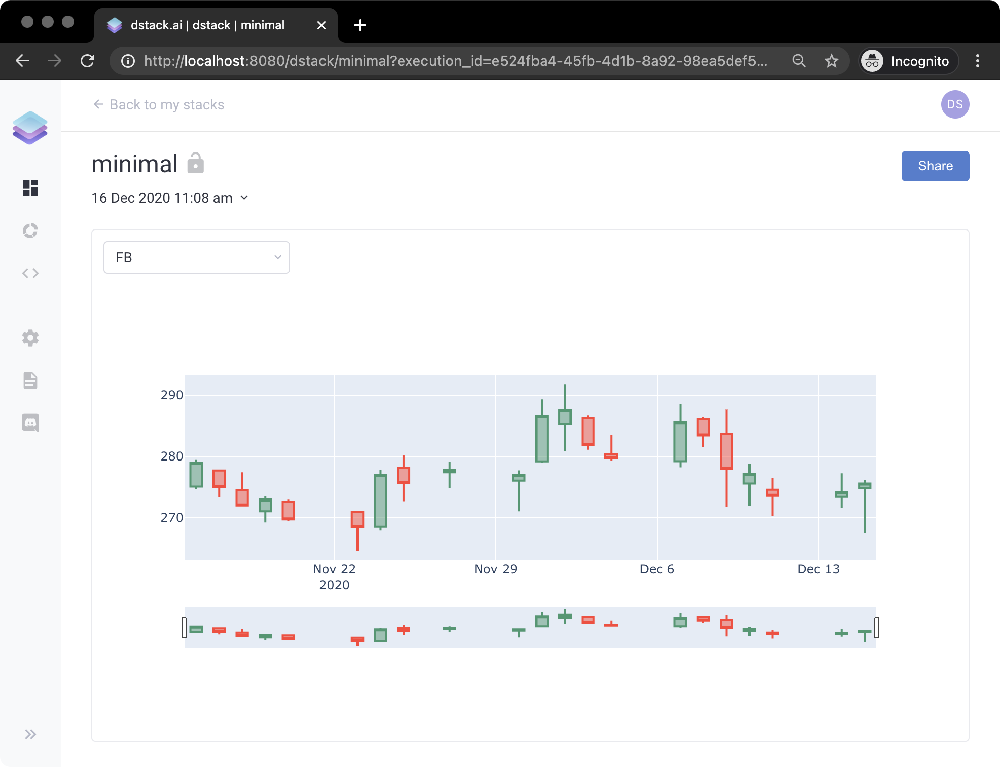

# Welcome to dstack

[dstack](https://dstack.ai) is an open-source Python library that makes it easy to build and manage web applications for data science and machine learning.

Installing and running `dstack` is very easy:

```bash
pip install --index-url https://test.pypi.org/simple/ --upgrade --no-cache-dir --extra-index-url=https://pypi.org/simple/ dstack==0.6dev22
dstack server start
```

If you run it for the first time, it may take a while. Once it's done, you'll see the following output:


To access the application, open this URL in the browser: `http://localhost:8080/auth/verify?user=dstack&code=xxxxxxxx-xxxx-xxxx-xxxx-xxxxxxxxxxxx&next=/`  
  
The default profile in `"~/.dstack/config.yaml"` is already configured. You are welcome to push your applications using Python package.



To access dstack, click the URL provided in the output. If you try to access dstack without using this URL, it will require you to sign up using a username and a password.


For more details on how to install and run `dstack`, please check the [Installation](installation.md) page.

If you open the URL, you'll see the following interface:



You're logged as the `dstack` user. The current page is `Applications`. It shows you all published applications which you have access to. The sidebar on the left lets you open other pages: `ML Models`, `Settings`, `Documentation`, and `Chat`.

Now let's build a simple application to see how `dstack` works in action.

### Minimal Application

Here's an elementary example of using `dstack`. The application takes real-time stock exchange data from Yahoo Finance for the FAANG companies and renders it for a selected symbol. 

Here's the Python code that you have to run to make such an application:

```python
from datetime import datetime, timedelta

import dstack.controls as ctrl
import dstack as ds
import plotly.graph_objects as go
import pandas_datareader.data as web


def get_chart(symbols: ctrl.ComboBox):
    start = datetime.today() - timedelta(days=30)
    end = datetime.today()
    df = web.DataReader(symbols.value(), 'yahoo', start, end)
    fig = go.Figure(
        data=[go.Candlestick(x=df.index, open=df['Open'], high=df['High'], low=df['Low'], close=df['Close'])])
    return fig


app = ds.app(get_chart, symbols=ctrl.ComboBox(["FB", "AMZN", "AAPL", "NFLX", "GOOG"]))

result = ds.push("faang", app)
print(result.url)
```

If you run it and click the provided URL, you'll see the application:



The user is prompted to choose one of the companies to view its latest market data in form of a candlestick chart.

To learn about how this application works and to see other examples, please check out the [Tutorials](tutorials/) page.



 To learn in more detail about what applications consist of and how to use all their features, check out the [Applications](applications/) page. 



Wanna know how to deploy ML models and use them from applications? Read the [ML Models](ml-models.md) page.



### Feedback

Do you have any feedback either minor or critical? Please, file [an issue](https://github.com/dstackai/dstack/issues) in our GitHub repo or write to us on our [Discord Channel](https://discord.com/invite/8xfhEYa).


**Have you tried `dstack`? Please share your feedback with us using** [**this**](https://forms.gle/4U6Z6hmZhbAtEDK29) **form!**


