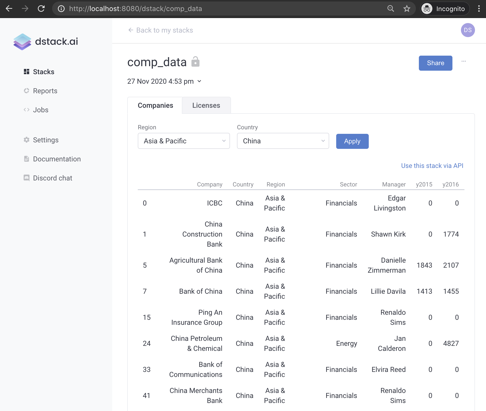

# Overview

A `dstack` application is a web application that is deployed to a `dstack` server using the Python client API. A `dstack` server may host multiple applications and provides capabilities to manage these applications and share them with multiple users.

Here's an example of a typical `dstack` application:



An application may have tabs \(see above `Companies` and `Licenses`\), user controls \(see above `Region`, `Country`, and `Apply`\), and the output that can be a table data or visualization \(see above the table data\). 

What tabs, user controls, and output that the application has are defined by the developer of the application.

In order to deploy an application, the developer of the application should define it using the API of `dstack`'s Python package. Here's an elementary example of the application that takes real-time stock exchange data from Yahoo Finance for the FAANG companies and renders it for a selected symbol:

```python
from datetime import datetime, timedelta

import dstack.controls as ctrl
import dstack as ds
import plotly.graph_objects as go
import pandas_datareader.data as web


def get_chart(symbols: ctrl.ComboBox):
    start = datetime.today() - timedelta(days=30)
    end = datetime.today()
    df = web.DataReader(symbols.value(), 'yahoo', start, end)
    fig = go.Figure(
        data=[go.Candlestick(x=df.index, open=df['Open'], high=df['High'], low=df['Low'], close=df['Close'])])
    return fig


app = ds.app(get_chart, symbols=ctrl.ComboBox(["FB", "AMZN", "AAPL", "NFLX", "GOOG"], require_apply=False))

result = ds.push("faang", app)
print(result.url)

```

Here, we define the function `get_chart` that takes the argument `symbols` of the type `ctrl.ComboBox`. The argument represents a combo box in which the user selects a stock symbol \(e.g. `"FB"`, `"AMZN"`, etc\). Based on the selected symbol \(see `symbols.value()`\), the function fetches the market data for the corresponding stock \(from the Yahoo Financial Services – using the `pandas_datareader` package\), makes a Candlestick chart \(using the `plotly` package\), and returns the resulting figure.

```python
def get_chart(symbols: ctrl.ComboBox):
    start = datetime.today() - timedelta(days=30)
    end = datetime.today()
    df = web.DataReader(symbols.value(), 'yahoo', start, end)
    fig = go.Figure(
        data=[go.Candlestick(x=df.index, open=df['Open'], high=df['High'], low=df['Low'], close=df['Close'])])
    return fig
```

Once the function is defined, we call the function `dstack.app` where we pass our function that produces the output and assigns an instance of `ctrl.ComboBox` into the argument named `symbols`. This call creates an instance of an application. The application contains information on the function that produces the visualizations and binds an instance `ctrl.ComboBox` to the name of the argument of the function \(`symbols`\).

```python
app = ds.app(get_chart, symbols=ctrl.ComboBox(["FB", "AMZN", "AAPL", "NFLX", "GOOG"], require_apply=False))
```

Finally, we deploy our application to the `dstack` server by using the function `dstack.push`. The arguments of the call are `"faang"` – the name of the application, and `app` – the instance of our application. If successful, this call returns a push result that has an attribute `url`. This is the URL of the deployed application.

```python
result = ds.push("faang", app)
print(result.url)
```

If we run all the code and click the URL, we'll see the application.

To see how a multi-tab application is defined, check out the [Complex Application](../tutorials/complex-application.md) tutorial.



If you'd like to learn what types of user controls are supported and how to use them, check out the [Controls](controls.md) page.

If you'd like to know how to improve the performance of your application by using caching, please check the [Caching](caching.md) page.

If you'd like to know how to deploy an application that depends on additional Python modules or third-party packages or simply additional files, check out the [Dependencies](dependencies.md) page.

If you'd like to know how to deploy ML models to dstack and how to use them from your application, check out the [ML models](../ml-models.md) page.



