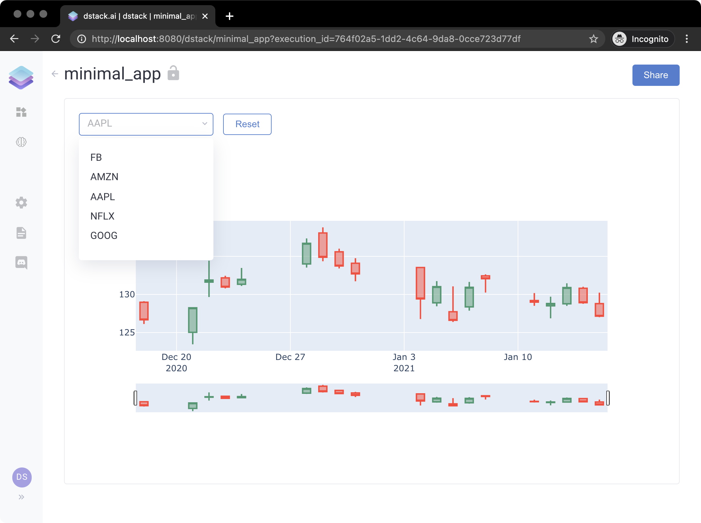
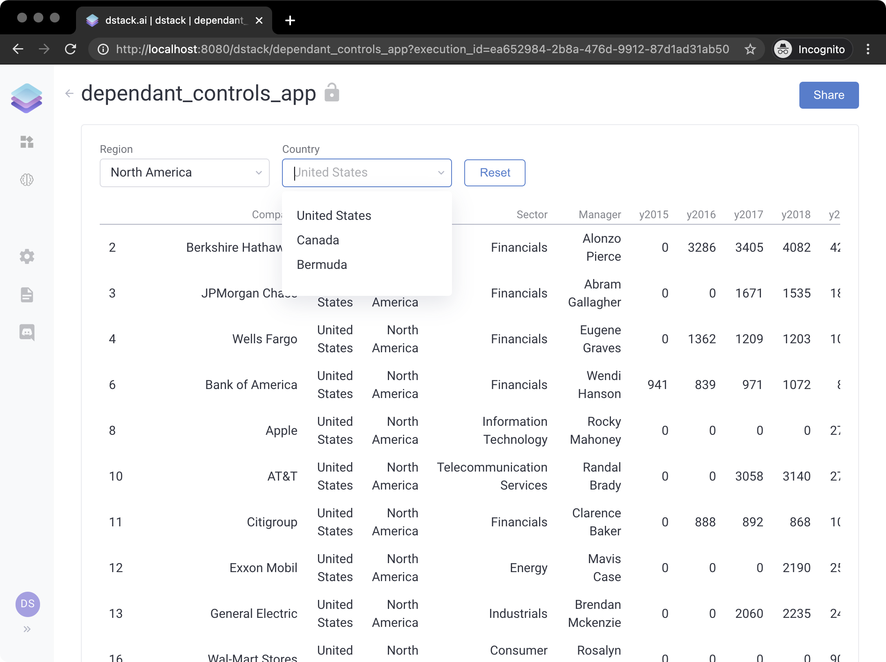
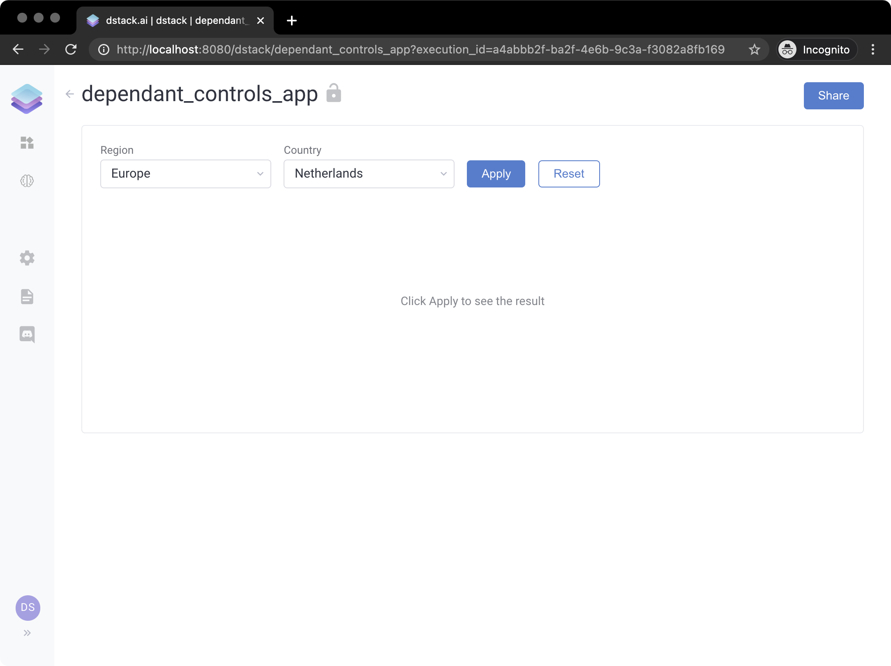

# Controls

A control is an element of the user interface that allows the user of the application to change input parameters. A `dstack` application may have any number of controls. The supported types of controls include text fields, combo boxes, sliders, check-boxes, and file uploaders. 

All controls inherit the base class `dstack.controls.Control`. They must be initiated and passed as `controls` to the function `dstack.app()`. Each output of the application may depend on any number of controls. By default, outputs depend on all controls if otherwise is not defined.  All controls the output depends on must be listed in the signature of the handler of the corresponding output.

Here's a simple example:

```python
from datetime import datetime, timedelta

import dstack.controls as ctrl
import dstack as ds
import plotly.graph_objects as go
import pandas_datareader.data as web


def output_handler(self: ctrl.Output, symbols: ctrl.ComboBox):
    start = datetime.today() - timedelta(days=30)
    end = datetime.today()
    df = web.DataReader(symbols.value(), 'yahoo', start, end)
    fig = go.Figure(
        data=[go.Candlestick(x=df.index, open=df['Open'], high=df['High'], low=df['Low'], close=df['Close'])])
    self.data = fig


app = ds.app(controls=[ctrl.ComboBox(data=["FB", "AMZN", "AAPL", "NFLX", "GOOG"])],
             outputs=[ctrl.Output(handler=output_handler)])

result = ds.push("minimal_app", app)
print(result.url)
```

If we run the example above and open the link, here's how the application will look like:



Controls may use user functions to populate their data \(e.g. load it from a database\). It's also possible to make controls dependant on each other, e.g. to update their state based on the state of other controls.

Here's another example, where one of the controls depends on the other one:

```python
import dstack.controls as ctrl
import dstack as ds
import pandas as pd


@ds.cache()
def get_data():
    return pd.read_csv("https://www.dropbox.com/s/cat8vm6lchlu5tp/data.csv?dl=1", index_col=0)


def get_regions():
    df = get_data()
    return df["Region"].unique().tolist()


def countries_handler(self: ctrl.ComboBox, regions: ctrl.ComboBox):
    df = get_data()
    self.data = df[df["Region"] == regions.value()]["Country"].unique().tolist()


regions = ctrl.ComboBox(data=get_regions, label="Region")
countries = ctrl.ComboBox(handler=countries_handler, label="Country", depends=[regions])


def output_handler(self: ctrl.Output, countries: ctrl.ComboBox):
    df = get_data()
    self.data = df[df["Country"] == countries.value()]


app = ds.app(controls=[regions, countries],
             outputs=[ds.Output(handler=output_handler, depends=[countries])])

result = ds.push('dependant_controls_app', app)
print(result.url)
```

If you run the code above and open the application, you'll see the following:



If you'd like the application to show the output only if the user clicks `Apply`, you can add `ctrl.Apply()` to the list of controls:

```python
app = ds.app(controls=[regions, countries, ctrl.Apply()],
             outputs=[ds.Output(handler=output_handler, depends=[countries])])
```

Here's how it would look then:



### Control API Reference

#### TextField

`dstack.controls.TextField`

<table>
  <thead>
    <tr>
      <th style="text-align:left">Parameter</th>
      <th style="text-align:left">Type</th>
      <th style="text-align:left">Description</th>
      <th style="text-align:left">Required</th>
    </tr>
  </thead>
  <tbody>
    <tr>
      <td style="text-align:left"><code>data</code>
      </td>
      <td style="text-align:left">
        <p>Can be one of the following:</p>
        <ul>
          <li><code>str</code>
          </li>
          <li><code>Callable[[], str]</code>
          </li>
        </ul>
      </td>
      <td style="text-align:left">The initial text value of the control.</td>
      <td style="text-align:left">Required if <code>handler</code> is not set.</td>
    </tr>
    <tr>
      <td style="text-align:left"><code>handler</code>
      </td>
      <td style="text-align:left"><code>Callable[..., None]</code>
      </td>
      <td style="text-align:left">The function that updates the state of the control.</td>
      <td style="text-align:left">Required if <code>data</code> is not set.</td>
    </tr>
    <tr>
      <td style="text-align:left"><code>long</code>
      </td>
      <td style="text-align:left"><code>bool</code>
      </td>
      <td style="text-align:left"><code>True</code> if the field may contain long values (text paragraphs). <code>False</code> by
        default.</td>
      <td style="text-align:left">No</td>
    </tr>
    <tr>
      <td style="text-align:left"><code>label</code>
      </td>
      <td style="text-align:left"><code>str</code>
      </td>
      <td style="text-align:left">The caption of the control.</td>
      <td style="text-align:left">No</td>
    </tr>
    <tr>
      <td style="text-align:left"><code>depends</code>
      </td>
      <td style="text-align:left">
        <p>Can be one of the following:</p>
        <ul>
          <li><code>List[Control]</code>
          </li>
          <li><code>Control</code>
          </li>
        </ul>
      </td>
      <td style="text-align:left">The other controls this control depends on.</td>
      <td style="text-align:left">No</td>
    </tr>
    <tr>
      <td style="text-align:left"><code>require_apply</code>
      </td>
      <td style="text-align:left">bool</td>
      <td style="text-align:left"><code>True</code> if the field requires an <code>Apply</code> button to be
        clicked for the application to update the output. <code>True</code> by default.</td>
      <td
      style="text-align:left">No</td>
    </tr>
    <tr>
      <td style="text-align:left"><code>optional</code>
      </td>
      <td style="text-align:left"><code>bool</code>
      </td>
      <td style="text-align:left"><code>True</code> if the filed&apos;s value is required for the application
        to provide the output. <code>False</code> by default. If it&apos;s <code>False,</code> the <code>data</code> is
        empty, and the Apply button is required, the <code>Apply</code> button will
        be disabled.</td>
      <td style="text-align:left">No</td>
    </tr>
  </tbody>
</table>

#### ComboBox

`dstack.controls.ComboBox`

<table>
  <thead>
    <tr>
      <th style="text-align:left">Parameter</th>
      <th style="text-align:left">Type</th>
      <th style="text-align:left">Description</th>
      <th style="text-align:left">Required</th>
    </tr>
  </thead>
  <tbody>
    <tr>
      <td style="text-align:left"><code>data</code>
      </td>
      <td style="text-align:left">
        <p></p>
        <p>Can be one of the following:</p>
        <ul>
          <li><code>List[Any]</code>
          </li>
          <li><code>Callable</code>
          </li>
        </ul>
        <p></p>
      </td>
      <td style="text-align:left">
        <p></p>
        <p>Can be one of the following:</p>
        <ul>
          <li>A list of items. <em>See example A.</em>
          </li>
          <li>A function that returns a list of items. <em>See example B.</em>
          </li>
        </ul>
      </td>
      <td style="text-align:left">Required if <code>handler</code> is not set.</td>
    </tr>
    <tr>
      <td style="text-align:left"><code>handler</code>
      </td>
      <td style="text-align:left"><code>Callable[..., None]</code>
      </td>
      <td style="text-align:left">The function that updates the state of the control.</td>
      <td style="text-align:left">Required if <code>data</code> is not set.</td>
    </tr>
    <tr>
      <td style="text-align:left"><code>selected</code>
      </td>
      <td style="text-align:left">
        <p>Can be one of the following:</p>
        <ul>
          <li><code>int</code>
          </li>
          <li><code>List[int]</code>
          </li>
        </ul>
      </td>
      <td style="text-align:left">
        <p>Can be one of the following:</p>
        <ul>
          <li>An index of the currently selected item. Only if <code>multiple</code> set
            to <code>False</code>.</li>
          <li>A list of indexes of the currently selected items. Only if <code>multiple</code> set
            to <code>True</code>.</li>
        </ul>
      </td>
      <td style="text-align:left">No</td>
    </tr>
    <tr>
      <td style="text-align:left"><code>multiple</code>
      </td>
      <td style="text-align:left"><code>bool</code>
      </td>
      <td style="text-align:left"><code>True</code> if multiple selection is allowed. <code>False</code> by
        default.</td>
      <td style="text-align:left">No</td>
    </tr>
    <tr>
      <td style="text-align:left"><code>label</code>
      </td>
      <td style="text-align:left"><code>str</code>
      </td>
      <td style="text-align:left">The caption of the control.</td>
      <td style="text-align:left">No</td>
    </tr>
    <tr>
      <td style="text-align:left"><code>depends</code>
      </td>
      <td style="text-align:left">
        <p>Can be one of the following:</p>
        <ul>
          <li><code>List[Control]</code>
          </li>
          <li><code>Control</code>
          </li>
        </ul>
      </td>
      <td style="text-align:left">The other controls this control depends on.</td>
      <td style="text-align:left">No</td>
    </tr>
    <tr>
      <td style="text-align:left"><code>require_apply</code>
      </td>
      <td style="text-align:left">bool</td>
      <td style="text-align:left"><code>True</code> if the field requires an <code>Apply</code> button to be
        clicked for the application to update the output. <code>True</code> by default.</td>
      <td
      style="text-align:left">No</td>
    </tr>
    <tr>
      <td style="text-align:left"><code>optional</code>
      </td>
      <td style="text-align:left">bool</td>
      <td style="text-align:left"><code>True</code> if the filed&apos;s value is required for the application
        to provide the output. <code>False</code> by default. If it&apos;s <code>False,</code> the <code>data</code> is
        empty, and the Apply button is required, the <code>Apply</code> button will
        be disabled.</td>
      <td style="text-align:left">No</td>
    </tr>
  </tbody>
</table>

#### CheckBox

`dstack.controls.CheckBox`

<table>
  <thead>
    <tr>
      <th style="text-align:left">Parameter</th>
      <th style="text-align:left">Type</th>
      <th style="text-align:left">Description</th>
      <th style="text-align:left">Required</th>
    </tr>
  </thead>
  <tbody>
    <tr>
      <td style="text-align:left"><code>data</code>
      </td>
      <td style="text-align:left">
        <p>Can be one of the following:</p>
        <ul>
          <li><code>bool</code>
          </li>
          <li><code>Callable</code>
          </li>
        </ul>
      </td>
      <td style="text-align:left">The initial value of the control.</td>
      <td style="text-align:left">Required if <code>handler</code> is not set.</td>
    </tr>
    <tr>
      <td style="text-align:left"><code>handler</code>
      </td>
      <td style="text-align:left"><code>Callable</code>
      </td>
      <td style="text-align:left">The function that updates the state of the control.</td>
      <td style="text-align:left">Required if <code>data</code> is not set.</td>
    </tr>
    <tr>
      <td style="text-align:left"><code>label</code>
      </td>
      <td style="text-align:left"><code>str</code>
      </td>
      <td style="text-align:left">The caption of the control.</td>
      <td style="text-align:left">No</td>
    </tr>
    <tr>
      <td style="text-align:left"><code>depends</code>
      </td>
      <td style="text-align:left">
        <p>Can be one of the following:</p>
        <ul>
          <li><code>List[Control]</code>
          </li>
          <li><code>Control</code>
          </li>
        </ul>
      </td>
      <td style="text-align:left">The other controls this control depends on.</td>
      <td style="text-align:left">No</td>
    </tr>
  </tbody>
</table>

