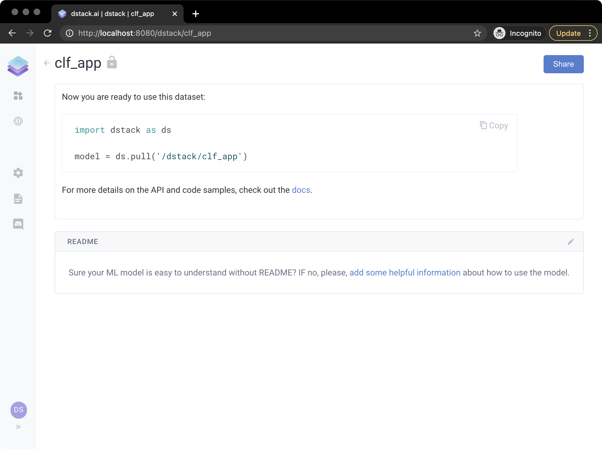

# ML Models

`dstack` decouples the development of applications from the development of ML models by offering an ML registry. This way, one can develop ML models, push them to the registry, and then later pull these models from applications. 

`dstack`'s  ML Registry supports `Tensorflow`, `PyTorch`, or `Scikit-Learn` models.

Here's a very simple example of how to push a model to `dstack`:

```python
from sklearn import datasets
from sklearn import svm
import dstack as ds

digits = datasets.load_digits()
clf = svm.SVC(gamma=0.001, C=100.)
clf.fit(digits.data[:-1], digits.target[:-1])

url = ds.push("clf_app", clf)
print(url)
```

Now, if you click the URL, it will open the following page:



Here you can see the snippet of how to pull the model from an application or from anywhere else:

```python
import dstack as ds

model = ds.pull('/dstack/clf_app')
```

Also, here you can edit a `README.md` file that will provide documentation on how to use this model. 

Check out the following tutorial on how to build an application that uses a simple ML model:




