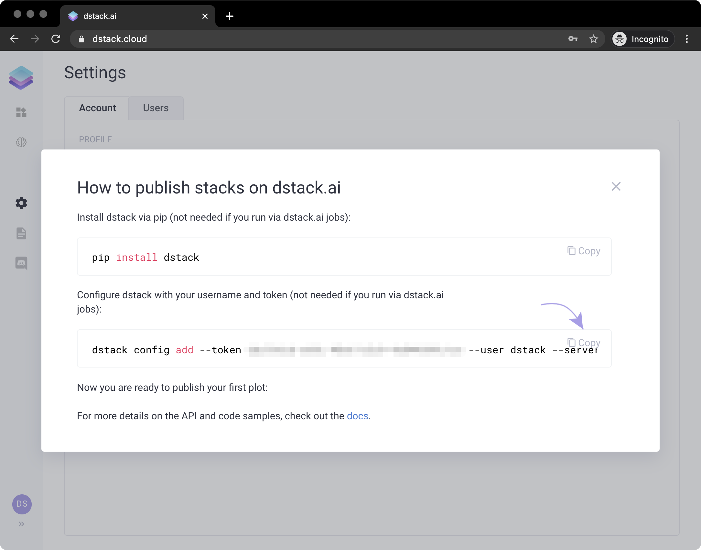
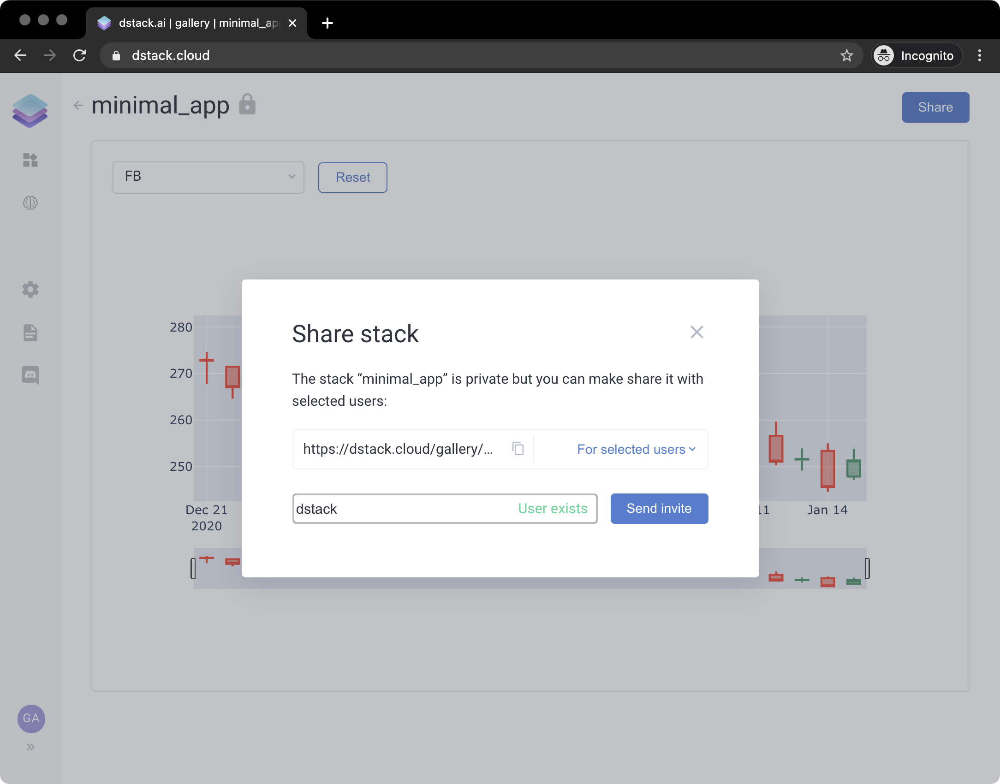

# Sharing

`dstack` supports two ways to share models and applications with others: inviting users to your `dstack` server or pushing your applications to [dstack.cloud](https://dstack.cloud).

#### Own Server

Inviting users to your `dstack` server can be done from the `Settings`: 

You can create a user, copy its invite link, and send it to the user over email or some other way.

Pushing applications to [dstack.cloud](https://dstack.cloud) is also easy and is don the following way:

Sign up for [dstack.cloud](https://dstack.cloud). Then, sign in, and open `Settings`, click the`Info` icon next to your `Token`:

You'll click it, you'll see the following popup. Copy the shell command that configures your `dstack` client:

Run the copied shell command snippet on the machine where you push applications or models. This command will change your `~/.dstack/config.yaml` to configure it to use [dstack.cloud](https://dstack.cloud) instead of your local server. 


If you'd like to revert it, e.g. if you'd like to work with the local server again, re-run the local server with the following command `dstack server start --override`. This will revert your `~/.dstack/config.yaml` file.


Push models and applications as you normally do. They'll be pushed to [dstack.cloud](https://dstack.cloud).

If you'd like to change the visibility settings of your applications or models, you can do it by clicking the `Share` button on the page of the corresponding application or model. You can change the access level, and if you select `For selected users`\(means it's private\), you can send invites with access to this application or model to any existing user or to any email.

