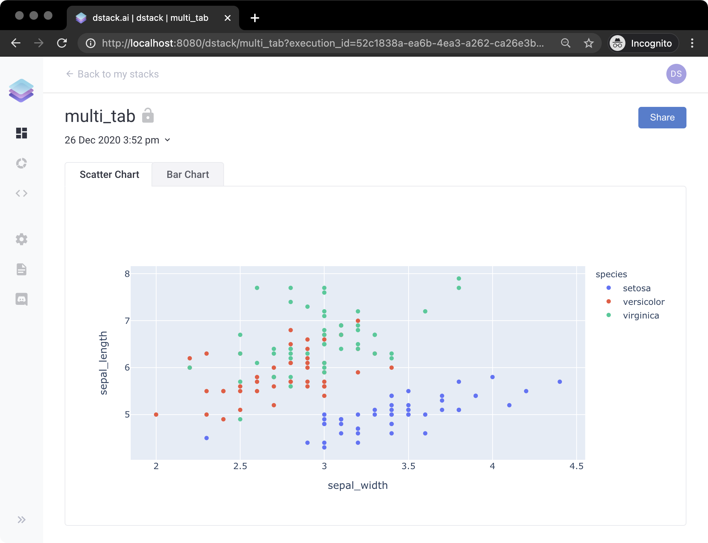

# Tabs

`dstack` allows applications to have multiple tabs. Here's an example of the application with two tabs: `"Scatter Chart"` and `"Bar Chart"`:

```python
import dstack as ds
import plotly.express as px


def scatter_handler():
    df = px.data.iris()
    return px.scatter(df, x="sepal_width", y="sepal_length", color="species")


def bar_handler():
    df = px.data.tips()
    return px.bar(df, x="sex", y="total_bill", color="smoker", barmode="group")


frame = ds.frame("multi_tab")

frame.add(ds.app(scatter_handler), params={"Scatter Chart": ds.tab()})
frame.add(ds.app(bar_handler), params={"Bar Chart": ds.tab()})

url = frame.push()
print(url)
```

In order to push an application with multiple tabs, one has to create a frame by using `dstack.frame()`, then call the function `add()` on the frame for every tab and pass there the corresponding output handler, and `params`, a dictionary with the name of the tab mapped to `ds.tab()`. Finally, the function `push` must be called on the frame. Just like `dstack.push()`, it pushes the application and returns its URL.

If you push the application from the example above and then open it's URL, you'll see the following:



Similar to applications with no tabs, every tab in a multi-tab application may have any number of controls.

