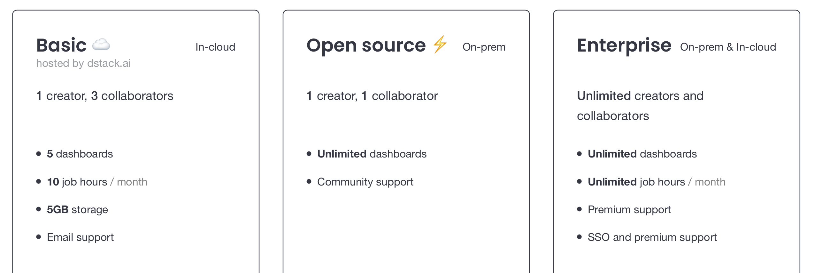

# Registration

Registered users can push their data to dstack.ai, create dashboards, and invite other users as collaborators.

To create a dstack.ai, take the following steps:

1. Fill out the Username, Work email and Password fields in the [registration form](https://dstack.ai/auth/signup), tick to agree with dstack.ai [Terms of Use](https://dstack.ai/terms) and [Privacy Policy](https://dstack.ai/privacy-policy), and click **Sign Up**.
2. Check your work email inbox. You'll receive an email with a link. Click the link from the email to finish the registration of your profile!

Now, your profile is ready! 🚀Now you can push data to dstack.ai using the API, create dashboards, and share them with your team.

## Pricing

