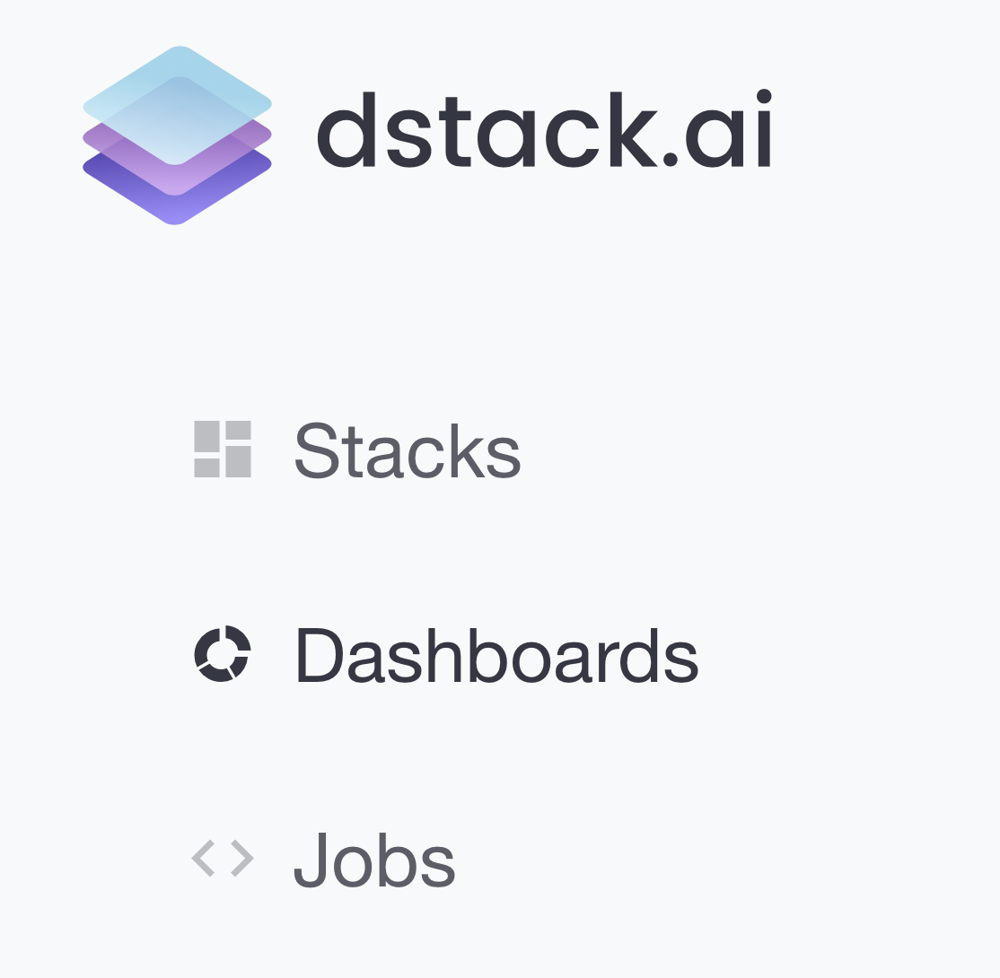

# Dashboards

### What are Dashboards?

Dashboards are a great way to build great-looking interactive reports. Once you've pushed your data to dstack.ai using the`dstack` packages for Python and R, you can combine your datasets and visualizations into interactive dashboards – with just a few clicks.

In order to build a dashboard, you only need to push your visualizations via Python or R API and then combine them into one dashboard with a few clicks.


Here's an example of a simple dashboard: [https://dstack.ai/cheptsov/d/505d2087-9adc-49e3-88de-6b46079c394f](https://dstack.ai/cheptsov/d/505d2087-9adc-49e3-88de-6b46079c394f)


If a **Stack** displays each moment a single visualization that corresponds to the selected parameters, a **Dashboard** displays multiple visualizations at once – also based on selected parameters.

### Creating a Dashboard

1. **Create** **Stacks** by [pushing](pushing-visualizations.md) your visualizations via the Python or R API. Those can be either Static or Interactive stacks. 
2. Click **Dashboards** in the sidebar of [dstack.ai](https://dstack.ai) and then click **New dashboard**.

4. You'll see a new empty Dashboard. Now, go ahead, click **Add Stack**, and select the Stacks that you'd like to put to your Dashboard. You can add as many Stacks as you'd like

5. Once you've selected the _Stacks_, click **Add selected stacks**. You'll see the selected _Stacks_ added to the current _Dashboard_.

6. Now you can change the title of the Dashboard or any of the Stacks by mouse-clicking their titles.

## Sharing Dashboards

Finally, you can switch the access level for this Dashboard between Public and Private, and share it with specific users by entering their usernames or emails. In order to do that, click _Share._

The user, with whom you've shared the dashboard, will be able to open the dashboard and see it updating based on the parameters selected. Note, the parameters are shown only in case the added stacks have parameters.

**That's it! Go ahead, and build your interactive dashboards right away! 🚀**

