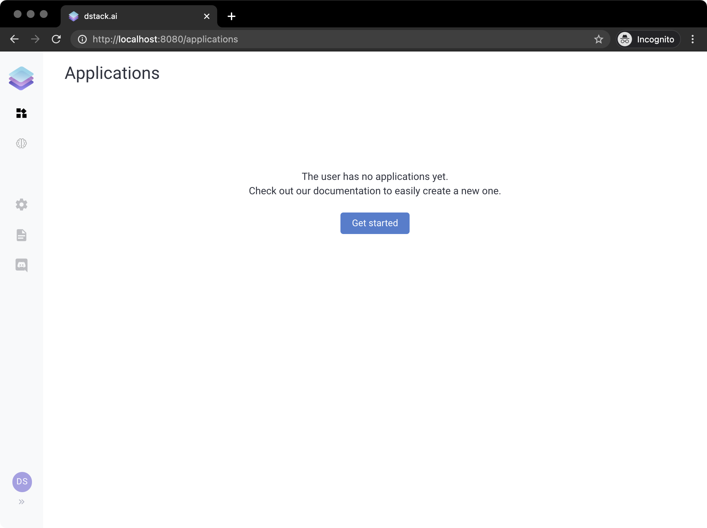
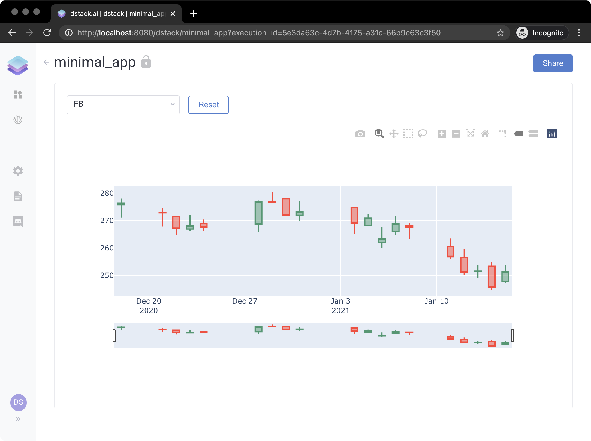

# 🚀 Quickstart

### Installation

Installing and running `dstack` is very easy:

```bash
pip install --index-url https://test.pypi.org/simple/ --upgrade --no-cache-dir --extra-index-url=https://pypi.org/simple/ dstack==0.6.1.dev3
dstack server start
```

If you run it for the first time, it may take a while. Once it's done, you'll see the following output:

```bash
$ dstack server start
To access the application, open this URL in the browser: http://localhost:8080/auth/verify?user=dstack&code=xxxxxxxx-xxxx-xxxx-xxxx-xxxxxxxxxxxx&next=/

The default profile in "~/.dstack/config.yaml" is already configured. You are welcome to push your data using Python or R packages.

What's next?
------------
- Checkout our documentation: https://docs.dstack.ai
- Ask questions and share feedback: https://discord.gg/8xfhEYa
- Star us on GitHub: https://github.com/dstackai/dstack
```


To access dstack, click the URL provided in the output. If you try to access dstack without using this URL, it will require you to sign up using a username and a password.


If you open the URL, you'll see the following interface:



You're logged as the `dstack` user. The current page is `Applications`. It shows you all published applications which you have access to. The sidebar on the left lets you open other pages: `ML Models`, `Settings`, `Documentation`, and `Chat`.

Now let's build a simple application to see how `dstack` works in action.

### Minimal Application

Here's an elementary example of using `dstack`. The application takes real-time stock exchange data from Yahoo Finance for the FAANG companies and renders it for a selected symbol. 

Here's the Python code that you have to run to make such an application:

```python
from datetime import datetime, timedelta

import dstack.controls as ctrl
import dstack as ds
import plotly.graph_objects as go
import pandas_datareader.data as web


def output_handler(self: ctrl.Output, symbols: ctrl.ComboBox):
    start = datetime.today() - timedelta(days=30)
    end = datetime.today()
    df = web.DataReader(symbols.value(), 'yahoo', start, end)
    fig = go.Figure(
        data=[go.Candlestick(x=df.index, open=df['Open'], high=df['High'], low=df['Low'], close=df['Close'])])
    self.data = fig


app = ds.app(controls=[ctrl.ComboBox(items=["FB", "AMZN", "AAPL", "NFLX", "GOOG"])],
             outputs=[ctrl.Output(handler=output_handler)])

result = ds.push("minimal_app", app)
print(result.url)
```

If you run it and click the provided URL, you'll see the application:




**Live Gallery:** [**https://dstack.cloud/gallery/minimal\_app**](https://dstack.cloud/gallery/minimal_app)\*\*\*\*


The user is prompted to choose one of the companies to view its latest market data in form of a candlestick chart. 

Let's take a closer look at this code and describe every step.

**Application output**

First, we define the function `output_handler` that takes the arguments `self` of the type `ctrl.Output` and `symbols` of the type `ctrl.ComboBox`. The first argument represents the output the function is supposed to update. The second argument represents a combo box control in which the user selects a stock symbol \(e.g. `"FB"`, `"AMZN"`, etc\). Based on the selected symbol \(see `symbols.value()`\), the function fetches the market data for the corresponding stock \(from the Yahoo Financial Services – using the `pandas_datareader` package\), makes a Candlestick chart \(using the `plotly` package\), and updates the attribute `data` of the output with the resulting figure.

```python
def output_handler(self: ctrl.Output, symbols: ctrl.ComboBox):
    start = datetime.today() - timedelta(days=30)
    end = datetime.today()
    df = web.DataReader(symbols.value(), 'yahoo', start, end)
    fig = go.Figure(
        data=[go.Candlestick(x=df.index, open=df['Open'], high=df['High'], low=df['Low'], close=df['Close'])])
    self.data = fig
```

**User controls and application**

Once this function is defined, we call the function `dstack.app()` where we pass lists of `controls` and `outputs`.  The attribute`controls` include an instance of `dstack.controls.ComboBox` wehere we pass a list of tickers.  The attribute `outputs` includes an instance of `dstack.controls.Output` where we pass our handler `output_handler`.

```python
app = ds.app(controls=[ctrl.ComboBox(items=["FB", "AMZN", "AAPL", "NFLX", "GOOG"])],
             outputs=[ctrl.Output(handler=output_handler)])
```

**Deploy application**

Finally, we deploy our application to the `dstack` server by using the function `dstack.push()`. The arguments of the call are `"minimal_app"` – the name of the application, and `app` – the instance of our application. If successful, this call returns a push result that has an attribute `url`. This is the URL of the deployed application.

```python
result = ds.push("minimal_app", app)
print(result.url)
```

If we click the URL, we'll see the application.

To learn in more detail about what applications consist of and how to use all their features, check out the [Concepts](concepts/) page. 



To see other examples, please check out the [Tutorials](tutorials/) page.




**Source Code:** [**github.com/dstackai/dstack-examples**](https://github.com/dstackai/dstack-examples/tree/master/simple_sklearn_ml_app)\*\*\*\*


### Feedback

Do you have any feedback either minor or critical? Please, file [an issue](https://github.com/dstackai/dstack/issues) in our GitHub repo or write to us on our [Discord Channel](https://discord.com/invite/8xfhEYa).


**Have you tried `dstack`? Please share your feedback with us using** [**this**](https://forms.gle/4U6Z6hmZhbAtEDK29) **form!**


