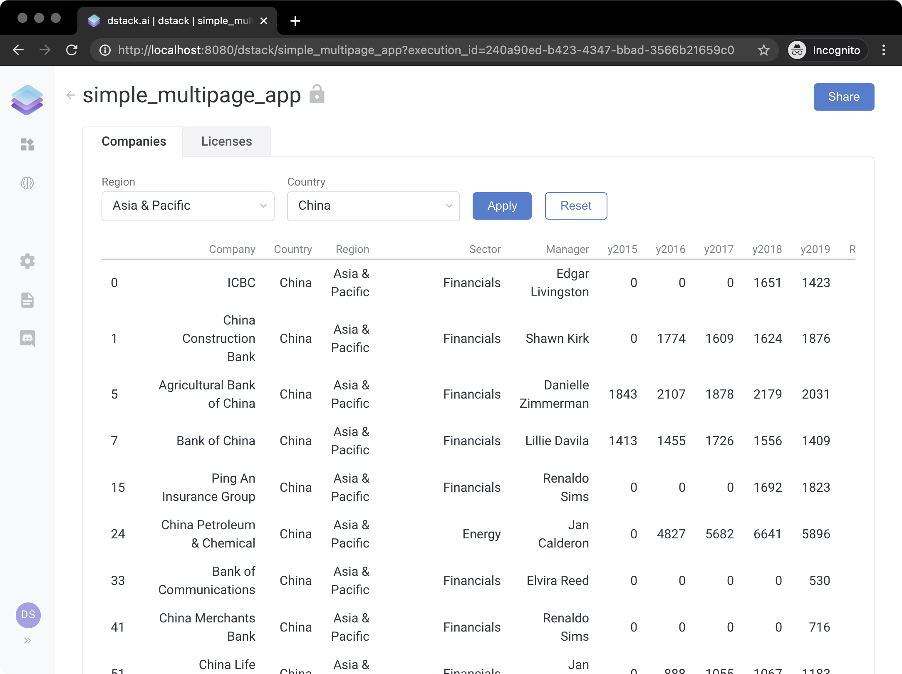

# Simple Application with Multiple Tabs

In this application, the user will see two tabs. In the first tab, the user will be prompted to choose a region and a country, then to see a list of companies and their data. The list of countries will depend on the selected region. In order to see the data, the user will have to confirm the selection by clicking the `Apply` button. In the second tab, the user will be able to see a chart with numbers of purchased licenses per year for the selected country.



Here's the full code of the application:

```python
import dstack.controls as ctrl
import dstack as ds
import pandas as pd
import plotly.express as px


@ds.cache()
def get_data():
    return pd.read_csv("https://www.dropbox.com/s/cat8vm6lchlu5tp/data.csv?dl=1", index_col=0)


def get_regions():
    df = get_data()
    return df["Region"].unique().tolist()


def get_countries_by_region(self: ctrl.ComboBox, regions: ctrl.ComboBox):
    df = get_data()
    self.data = df[df["Region"] == regions.value()]["Country"].unique().tolist()


regions = ctrl.ComboBox(data=get_regions, label="Region")
countries = ctrl.ComboBox(handler=get_countries_by_region, label="Country", depends=[regions], require_apply=True)


def get_data_by_country(regions: ctrl.ComboBox, countries: ctrl.ComboBox):
    df = get_data()
    return df[df["Country"] == countries.value()]


data_by_country_app = ds.app(get_data_by_country, regions=regions, countries=countries)


def get_companies():
    df = get_data()
    return df["Company"].unique().tolist()


companies = ctrl.ComboBox(data=get_companies, label="Company")


@ds.cache()
def get_data_by_company(companies: ctrl.ComboBox):
    df = get_data()
    row = df[df["Company"] == companies.value()].filter(["y2015", "y2016", "y2017", "y2018", "y2019"], axis=1)
    row.rename(columns={"y2015": "2015", "y2016": "2016", "y2017": "2017", "y2018": "2018", "y2019": "2019"},
               inplace=True)
    col = row.transpose()
    col.rename(columns={col.columns[0]: "Licenses"}, inplace=True)
    fig = px.bar(col.reset_index(), x="index", y="Licenses", labels={"index": "Year"})
    fig.update(layout_showlegend=False)
    return fig


data_by_company_app = ds.app(get_data_by_company, companies=companies)

frame = ds.frame("comp_data")
frame.add(data_by_country_app, params={"Companies": ds.tab()})
frame.add(data_by_company_app, params={"Licenses": ds.tab()})
result = frame.push()
print(result.url)
```


**Live Gallery:** [**https://dstack.cloud/gallery/simple\_multipage\_app**](https://dstack.cloud/gallery/simple_multipage_app)\*\*\*\*


Let's take a closer look at every step.

In this example, for every tab, we create a separate application and push it along with the name of the tab within a single frame to the `dstack` server.

Let's start with the first tab.

**Data**

First, we define a function `get_data` which fetches data from an external source and returns a pandas dataframe with this data.

```python
@ds.cache()
def get_data():
    return pd.read_csv("https://www.dropbox.com/s/cat8vm6lchlu5tp/data.csv?dl=1", index_col=0)
```


Note, in order to improve the performance of our application, we use the annotation `@dstack.cache`. This annotation wraps the function to make sure that the result of the function is cached, so when it's called the next time, the function is not called again. 


**User controls**

Second, we define `get_regions` that returns regions that appear in the data. This function is going to be used to populate the values of the combo box `"Region"`.

```python
def get_regions():
    df = get_data()
    return df["Region"].unique().tolist()
```

Then, we define a function `get_countries_by_region` that updates the combo box `Country` based on the selection of the combo box `Region`.

```python
def get_countries_by_region(self: ctrl.ComboBox, regions: ctrl.ComboBox):
    df = get_data()
    self.data = df[df["Region"] == regions.value()]["Country"].unique().tolist()
```

After that, we define our combo boxes `Region` and `Country`. Notice, that the second combo box depends on the first combo box. This is specified by the attribute `depends_on` provided by `dstack.controls.Control` \(and its subclasses such as `dstack.controls.ComboBox`\).

```python
regions = ctrl.ComboBox(data=get_regions, label="Region")
countries = ctrl.ComboBox(handler=get_countries_by_region, label="Country", depends=[regions], require_apply=True)
```

Since we set attribute `require_apply` to `True` in the second control, the resulting application will prompt the user to click the `Apply` button to see the output of the application.

**Application output**

Now, we can define the function `get_data_by_country` that produces the output of our application based on selected values in our combo boxes.

```python
def get_data_by_country(regions: ctrl.ComboBox, countries: ctrl.ComboBox):
    df = get_data()
    return df[df["Country"] == countries.value()]
```

**Application**

Finally, we create an application by using the `dstack.app` function and passing our function `data_by_country_app` and binding its arguments to our controls `regions` and `countries`.

```python
data_by_country_app = ds.app(get_data_by_country, regions=regions, countries=countries)
```

The application for the first tab is ready, let's move on and create the other one.

**Data**

We start by defining the function `get_companies`. This function is going to be used to populate the combo box `Company`.

```python
def get_companies():
    df = get_data()
    return df["Company"].unique().tolist()
```

**User controls**

Then, we define this combo box and set `require_apply` to `False` so the tab doesn't require the user to click `Apply` to see the result.

```python
companies = ctrl.ComboBox(data=get_companies, label="Company", require_apply=False)
```

**Application output**

Then, we define a function `get_data_by_company` that produces a Plotly chart with numbers of purchased licenses for the selected company grouped by the year.

```python
@ds.cache()
def get_data_by_company(companies: ctrl.ComboBox):
    df = get_data()
    row = df[df["Company"] == companies.value()].filter(["y2015", "y2016", "y2017", "y2018", "y2019"], axis=1)
    row.rename(columns={"y2015": "2015", "y2016": "2016", "y2017": "2017", "y2018": "2018", "y2019": "2019"},
               inplace=True)
    col = row.transpose()
    col.rename(columns={col.columns[0]: "Licenses"}, inplace=True)
    fig = px.bar(col.reset_index(), x="index", y="Licenses", labels={"index": "Year"})
    fig.update(layout_showlegend=False)
    return fig
```


Here, we also use the annotation `@dstack.cache` to prevent the function to be called when it is not necessary.


**Application**

Now, we're ready to create the second application by using the `dstack.app` function, where we pass our function `get_data_by_company` and bind the name of its argument to the combo box.

```text
data_by_company_app = ds.app(get_data_by_company, companies=companies)
```

#### Deploy applications

Finally, we are ready to push both applications and tabs to the dstack server. Since we push more than one application, we have to first create a frame \(by using the `dstack.frame` function\), and then adding our applications \(by using the `dstack.stack.StackFrame.add` function\).

```python
frame = ds.frame("comp_data")
frame.add(data_by_country_app, params={"Companies": ds.tab()})
frame.add(data_by_company_app, params={"Licenses": ds.tab()})
```

Notice, to associate an application with a tab, we use the attribute `params` of the `add` function. There, the name of the param is supposed to be the title of the tab. The value of the param must be set to `dstack.tab()`.

The last thing is pushing the frame with `dstack.stack.StackFrame.push`.

```python
result = frame.push()
print(result.url)
```

If we click the URL, we'll see the application. With this application, the user may switch between tabs, change the controls, and see the updating outputs.


**Source Code:** [**github.com/dstackai/dstack-examples**](https://github.com/dstackai/dstack-examples/tree/master/simple_sklearn_ml_app)\*\*\*\*


