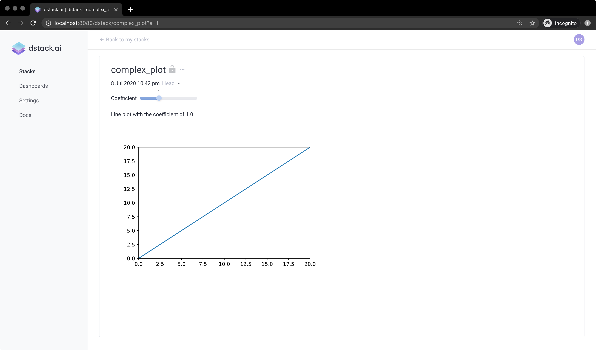
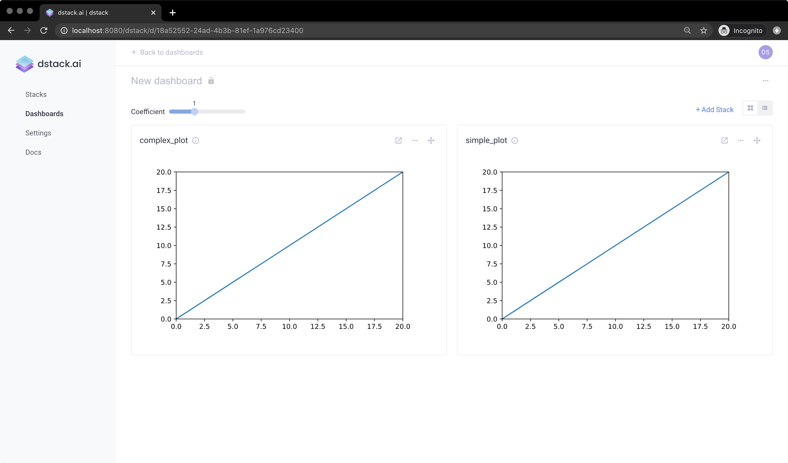
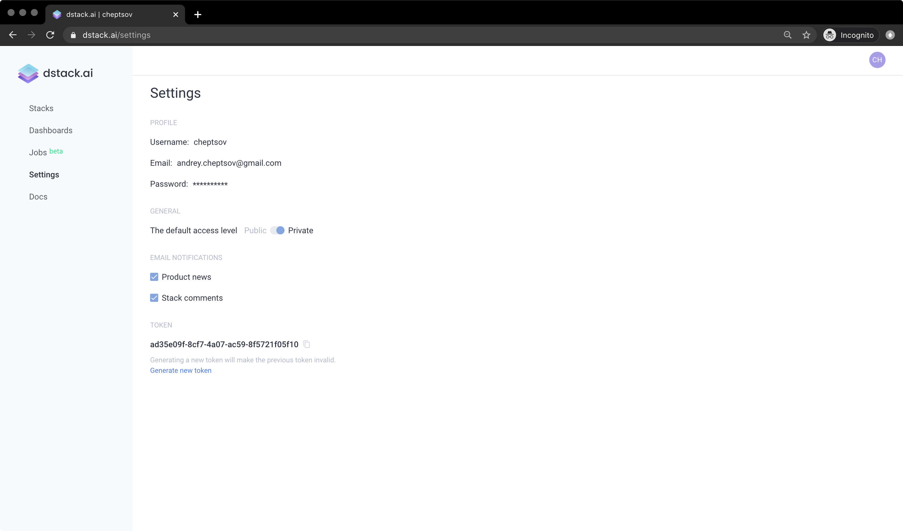

# Building Interactive Reports

## A quick start guide on building reports with dstack and Python.


This tutorial does not cover the installation process of `dstack`client packages which is required for this tutorial to be followed. You can easily do the Installation by going to the [Installation](../open-source/installation.md) page in Getting Started. 




### 1. Pushing visualizations

Before you can combine your data into a report, you have to push your visualizations to the server. This can be done via the dstack package for Python or R. In our tutorial, we'll use the Python package.

The easiest way yo work with dstack Python package is from a Jupyter notebook.

Go ahead and run you Jupyter notebook using this command:

```bash
jupyter notebook
```

In case you don't have Jupyter installed, you can quickly install it via `conda install jupyter` or `pip install jupyter`.

Let's create a new Python 3 notebook and define a function that returns a plot. In this tutorial we'll `matplotlib`, but if you want to can use something else, e.g. `plotly:`

```python
import matplotlib.pyplot as plt

def line_plot(a):
    xs = range(0, 21)
    ys = [a * x for x in xs]
    fig = plt.figure()
    plt.axis([0, 20, 0, 20])
    plt.plot(xs, ys)
    return fig
```

Now, invoke this function with some parameter in the next cell:

```python
fig = line_plot(1)
```

If everything is fine, you'll see the visualization rendered in the cell output.

Now, let's push this visualization to the dstack server:

```python
import dstack as ds

ds.push("simple_plot", fig, """
# My simple plot

How do you like my plot?""")
```

If you run this code in Jupyter, you'll see a link in the output. You can use this link to access the visualization on the dstack server.

Open the link from the output in the browser to see how it works.

Now let's do something more complex. Invoke the function in the loop with different arguments and push resulted plots at once to the server:

```python
import dstack as ds

frame = ds.frame("complex_plot")
coeff = [0.5, 1.0, 1.5, 2.0]

for c in coeff:
    frame.commit(line_plot(c), f"Line plot with the coefficient of {c}", {"Coefficient": c})

frame.push()
```

Open the link from the output in the browser to see the result, and try to change parameters:



As you see the server let you change the parameter and shows you the visualization that corresponds to the selection. When you submit visualizations to the server, you're allowed to use as many parameters as you want. The server will automatically combine them into interactive selection control widgets.

### 2. Building a Report

After you've pushed your visualizations to the server, you can combine them into an interactive report and apply a required layout.

To create a report, make sure you've logged in to the dstack web application using the link provided by the `dstack server` command. If you don't log in, you'll see the web application as a guest user and won't be able to manage dashboards.

When you're logged in, click `Reports` on the left-hand panel and then click `New Report`. In the popup, you'll see all available Stacks \(this is how visualizations are called by the server\). Select those Stacks that you'd like to add to your report.



You can change the layout using the icons in the right-top corner, change the dashboard's and stacks' titles.

By default, the server makes all pushed visualizations and dashboards public. You can set the access level for any stack to private when you push it from the Python code by adding the argument `access` to the `frame` or `push` functions set to `'private'`:

```python
import dstack as ds

ds.push_frame("simple_plot", fig, """
# My simple plot

How do you like my plot?""", access = "private")
```

In case you're hosting the data with the in-cloud version of dstack.ai, you'll be able to change the default access level in the settings:



Another feature of the in-cloud version of dstack.ai is the `Share` button that is available for both stacks and reports. If you click this button, you'll be able to change the access level for any stack or report individually and also share it with specific users of dstack.ai.


If the user is not registered, you can use the email. In that case, dstack.ai will send an invitation link to the user.

