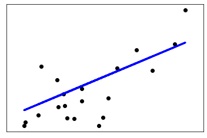

# Scikit-learn

We will use the **sklearn.datasets** package to use the diabetes dataset to make and deploy a **simple Linear Regression Model in just 2 minutes!**

#### 1. Importing Libraries and dstack

We will first import _scikit-learn_, _numpy_ and _matplotlib_ for plotting and of course the `push_frame` and `pull` methods from _dstack_

```python
import matplotlib.pyplot as plt
import numpy as np
from sklearn import datasets, linear_model
from sklearn.metrics import mean_squared_error, r2_score
from sklearn.linear_model import LinearRegression
import sklearn

from dstack import push_frame, pull
```

#### 2. Loading and Splitting Dataset

Let's load our diabetes dataset now from scikit-learn, and split it.

```python
# Loading diabetes databse
diabetes_X, diabetes_y = datasets.load_diabetes(return_X_y=True)

# Use only one feature
diabetes_X = diabetes_X[:, np.newaxis, 2]

# Split the data into training/testing sets
diabetes_X_train = diabetes_X[:-20]
diabetes_X_test = diabetes_X[-20:]

# Split the targets into training/testing sets
diabetes_y_train = diabetes_y[:-20]
diabetes_y_test = diabetes_y[-20:]
```

#### 3. Fitting the Model

Finally we fit the model with the `LinearRegression()` object in scikit-learn 

```python
# Create linear regression object
regr = LinearRegression()

# Fitting the linear model
regr.fit(diabetes_X_train, diabetes_y_train)
```

#### 4. Pushing to dstack 

Now that our model is fit and ready, we push it to dstack as a stack using the `push_frame()`method

```python
# Push the frame
push_frame("simpleLinearReg", regr, "My first linear model")
```

#### 5. Pulling from dstack 

Now that you have it pushed on a Stack, you can share it with anyone so they can pull the model and use it, or you can pull it and re-use it anytime you like as well! Let's see how we can pull the model from the Stack and use it to display a plot.

```python
# Pull from the Stack
my_model = pull("simpleLinearReg")
```

That's it! You have pulled your model. It's that easy. 

**6. Making Predictions and Plotting**

Now we can use the model to make predictions and use Matplotlib for plotting.

```python
# Make predictions using the testing set
diabetes_y_pred = my_model.predict(diabetes_X_test)

# Plot outputs
plt.scatter(diabetes_X_test, diabetes_y_test,  color='black')
plt.plot(diabetes_X_test, diabetes_y_pred, color='blue', linewidth=3)

plt.xticks(())
plt.yticks(())

plt.show()
```

You should see the following output.



You can also push this plot onto dstack and create a dashboard with the model, plot as well as the dataset! Read the tutorial on the [plotting libraries](../plotting-libraries/matplotlib.md) to try this out.

## Common Problems and Debugging

### AttributeError

This error means you probably haven't called `.fit()` method on the Linear Regression model.

```text
AttributeError: 'LinearRegression' object has no attribute 'coef_'
```


