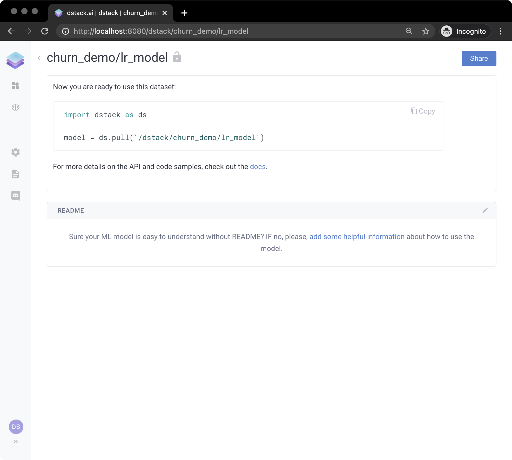

# Simple Application with a Scikit-learn ML Model

`dstack` decouples the development of applications from the development of ML models by offering an ML registry. This way, one can develop ML models, push them to the registry, and then later pull these models from applications. 

Here's an example. Let's start by training a very simple model:

```python
import pandas as pd
from sklearn.model_selection import train_test_split
from sklearn.linear_model import LogisticRegression
import dstack as ds

def transform(X, countries, sectors):
    def n_years(row):
        l = [row["y2019"], row["y2018"], row["y2017"], row["y2016"], row["y2015"]]
        return len([x for x in l if x != 0])
    
    X = X.copy()
    X["nyears"] = X.apply(n_years, axis=1)
    
    X = X.drop(["Company", "Region", "Manager", "Churn", "RenewalMonth", "RenewalDate"], axis=1)
    
    year_col = ["y2015", "y2016", "y2017", "y2018", "y2019"]
    for col in year_col:
        X[col] = X[col] / X[col].max()
    for c in countries:
        X[c] = X["Country"].apply(lambda x: 1 if x == c else 0)
    for s in sectors:
        if s:
            X[s] = X["Sector"].apply(lambda x: 1 if x == s else 0)
    
    X = X.drop(["Country", "Sector"], axis=1)
    return X
    
df = pd.read_csv("https://www.dropbox.com/s/cat8vm6lchlu5tp/data.csv?dl=1", index_col=0)
    
countries = df["Country"].unique()
sectors = df["Sector"].unique()

X = df[df["RenewalMonth"] < 10].copy()
y = X["Churn"]
X = transform(X, countries, sectors)

X_train, X_test, y_train, y_test = train_test_split(X, y, test_size=0.3, random_state=99)

model = LogisticRegression()
model.fit(X_train, y_train)

url = ds.push("churn_demo/lr_model", model)
print(url)
```

If we run this code, it will train the model and push it to `dstack`. In the output, you'll see its URL which you can use to view the model via the interface. If you click it, you'll see the following:




**Live Gallery:** [**https://dstack.cloud/gallery/simple\_sklearn\_ml\_model**](https://dstack.cloud/gallery/simple_sklearn_ml_model)\*\*\*\*


Now, this model is stored with `dstack`'s registry and can be pulled from any application. Let's look at an example of an application that uses this model:

```python
import dstack as ds
import dstack.controls as ctrl
import pandas as pd


def get_model():
    return ds.pull("churn_demo/lr_model")


def transform(X, countries, sectors):
    def n_years(row):
        l = [row["y2019"], row["y2018"], row["y2017"], row["y2016"], row["y2015"]]
        return len([x for x in l if x != 0])

    X = X.copy()
    X["nyears"] = X.apply(n_years, axis=1)

    X = X.drop(["Company", "Region", "Manager", "Churn", "RenewalMonth", "RenewalDate"], axis=1)

    year_col = ["y2015", "y2016", "y2017", "y2018", "y2019"]

    for col in year_col:
        X[col] = X[col] / X[col].max()

    for c in countries:
        X[c] = X["Country"].apply(lambda x: 1 if x == c else 0)

    for s in sectors:
        if s:
            X[s] = X["Sector"].apply(lambda x: 1 if x == s else 0)

    X = X.drop(["Country", "Sector"], axis=1)
    return X


@ds.cache()
def get_data():
    df = pd.read_csv("https://www.dropbox.com/s/cat8vm6lchlu5tp/data.csv?dl=1", index_col=0)

    countries = df["Country"].unique()
    sectors = df["Sector"].unique()

    x1 = df[df["RenewalMonth"] >= 10].copy()
    x1a = transform(x1, countries, sectors)
    return x1, x1a


x1, x1a = get_data()

months = ['Jan', 'Feb', 'Mar', 'Apr', 'May', 'Jun', 'Jul', 'Aug', 'Sep', 'Oct', 'Nov', 'Dec']

regions_ctrl = ctrl.ComboBox(x1["Region"].unique().tolist(), label="Region")
months_ctrl = ctrl.ComboBox(['Oct', 'Nov', 'Dec'], label="Month")
churn_ctrl = ctrl.CheckBox(label="Churn", selected=True, require_apply=False)


def app_handler(regions_ctrl: ctrl.ComboBox, months_ctrl: ctrl.ComboBox, churn_ctrl: ctrl.CheckBox):
    x1, x1a = get_data()
    y1_pred = get_model().predict(x1a)
    data = x1.copy()
    data["Predicted Churn"] = y1_pred
    data["Predicted Churn"] = data["Predicted Churn"].apply(lambda x: "Yes" if x == 1.0 else "No")
    data["RenewalMonth"] = data["RenewalMonth"].apply(lambda x: months[x - 1])
    data = data.drop(["y2015", "y2016", "y2017", "y2018", "y2019", "Churn"], axis=1)

    data = data[(data["Predicted Churn"] == ("Yes" if churn_ctrl.selected else "No"))]
    data = data[(data["Region"] == regions_ctrl.value())]
    data = data[(data["RenewalMonth"] == months_ctrl.value())]
    return data


app = ds.app(app_handler, regions_ctrl=regions_ctrl, months_ctrl=months_ctrl, churn_ctrl=churn_ctrl)

url = ds.push("churn_demo/app", app)
print(url)
```

Now, if we run this code, and open the URL from the output, we'll see the following:



**Live Gallery:** [**https://dstack.cloud/gallery/simple\_sklearn\_ml\_app**](https://dstack.cloud/gallery/simple_sklearn_ml_app)\*\*\*\*


Now, if you push another version of the model using the same name, the application will immediately switch to the new version of the model.


**Source Code:** [**github.com/dstackai/dstack-examples**](https://github.com/dstackai/dstack-examples/tree/master/simple_sklearn_ml_app)\*\*\*\*


`dstack` supports `Tensorflow`, `PyTorch`, or `Scikit-Learn` models.

